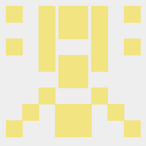

# rust_hash_avatar
## rust编写的hash头像生成库

## [在https://crates.io中查看](https://crates.io/crates/hash_avatar)

```rust
use hash_avatar::Generator;

fn main() {
    Generator::new()
        .create()
        .save_to_png("fractal.png")
        .unwrap();
    Generator::new()
        .set_img_size(250)
        .set_padding(10)
        .set_block_num(8)
        .create()
        .save_to_png("fractal2.png")
        .unwrap();
}
```

## 运行Example
```sh
git pull https://github.com/t924417424/rust_hash_avatar.git master
cd rsut_hash_avatar
cargo run --example test
```

## 生成结果

